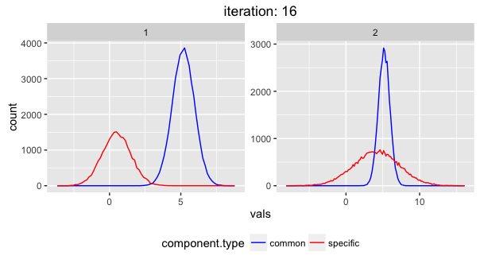

# comixr
[](https://travis-ci.org/daniel-wells/comixr)

This is an R package for fitting gaussian mixture models with shared components across multiple 1-dimensional data sets.



## Installation

```R
# install.packages("devtools")
devtools::install_github("daniel-wells/comixr")
```

## Use
For examples of how to use the function please see the [compiled vignette](http://rpubs.com/wells/comixr).

There are also vignettes containing full mathematical descriptions of the model and the update equations both for the [expectation maximiseation](https://cdn.rawgit.com/daniel-wells/comixr/master/vignettes/GMM-EM.html) and [variational bayes](https://cdn.rawgit.com/daniel-wells/comixr/master/vignettes/GMM-VB.html) algorithms.

## Directory Organisation
The [R/](R/) directory contains source code of the functions to fit the models and plot resulting components.

The [man/](man/) directory contains the manual pages for the functions, compiled by roxygen.

The [vignettes/](vignettes/) directory contains uncompiled Rmarkdown with examples of use and the equations underlying the model. (Links to compiled versions above)

The [tests/](tests/) directory contains the unit tests which are carried out by the testthat R package.

Contributions of any size or form are welcome!